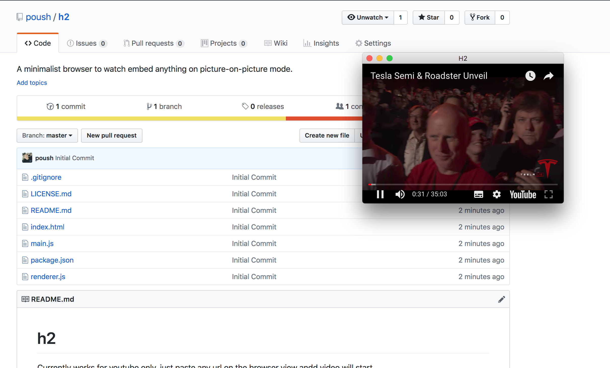

# H2
Inspired by the Helium app, **H2** is a minimalist browser to watch embeded videos and more in  picture-in-picture mode.
# Features
:tv: Works with any Youtube URL.  
:scroll: Works with PDFs links, Google Docs URLs.  
:computer: Works on all platforms, thanks to electron ❤️  
:clock9:[WIP] After [#22](https://github.com/poush/H2/pull/22) a basic image editor, many other features coming soon.  
# Example

## Installation
* [Windows](guides/windows.md)
* [Mac](guides/mac.md)
* [Linux](guides/linux.md)
## Usage
* Copy any youtube, PDF or google docs URL and press `Ctrl/Command + Shift + V`  
## Contributing
```bash
# Clone this repository
git clone https://github.com/poush/h2
# Go into the repository
cd h2
# Install dependencies
npm install
# Run the app
npm start
```
## Bug
Sometimes app doesn't run over the top of mac screens
## Credits

## License
[CC0-1.0](https://github.com/poush/H2/blob/master/LICENSE.md)
