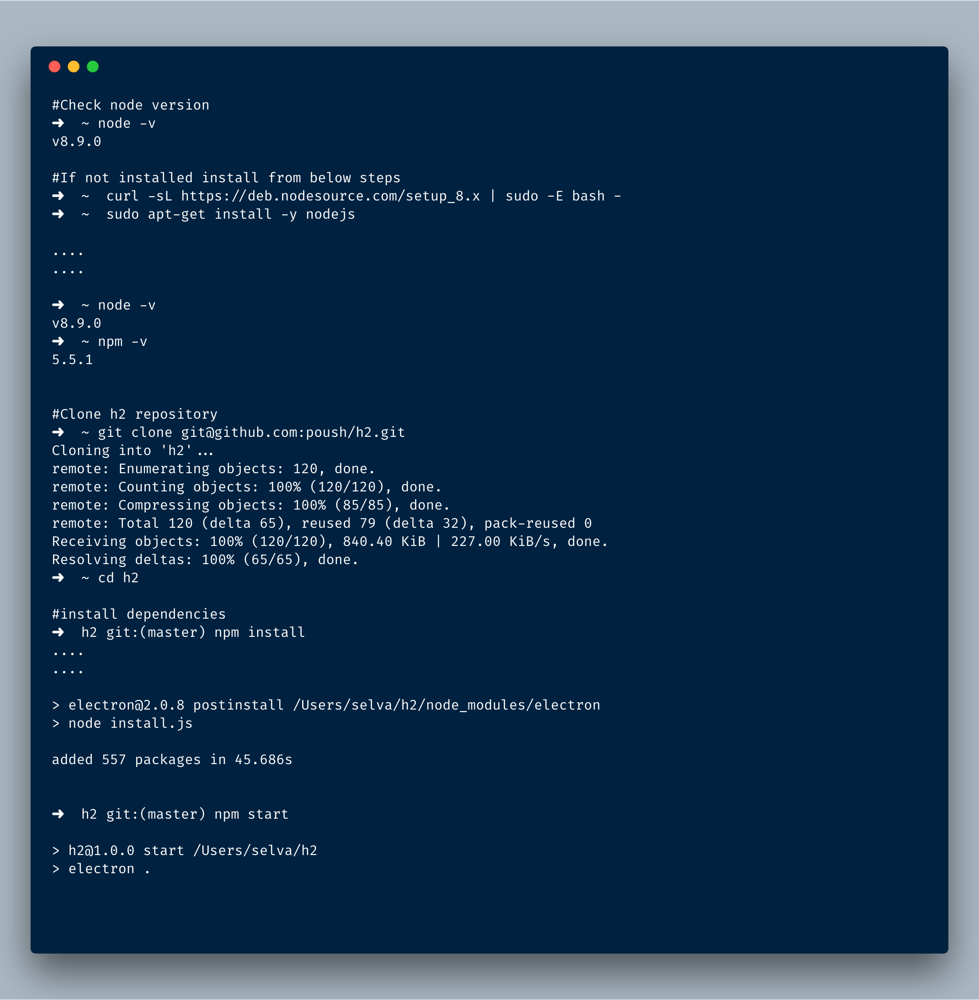

# Linux H2 Installation

Follow the steps from below



### Shell script installation

- For first time install clone the repo https://github.com/poush/h2.git
- Run the shell script `cd h2/install`
- `sh ./linux.sh`

Once started we will be default window like below


Paste any youtube url on opened window using `cmd + shift + v`


Move the window to any place!


### Problems on Ubuntu 18.04

On Ubuntu 18.04 this error message can be displayed

```
error while loading shared libraries: libgconf-2.so.4: cannot open shared object file: No such file or directory
npm ERR! file sh
npm ERR! code ELIFECYCLE
npm ERR! errno ENOENT
npm ERR! syscall spawn
npm ERR! h2@1.0.0 start: `electron .`
npm ERR! spawn ENOENT
npm ERR!
npm ERR! Failed at the h2@1.0.0 start script.
npm ERR! This is probably not a problem with npm. There is likely additional logging output above.
```

To solve this you have to install the libgconf 2.4 by typing `sudo apt install libgconf-2-4`

It is a known issue with electron on Ubuntu see here: https://github.com/electron/electron/issues/1518
