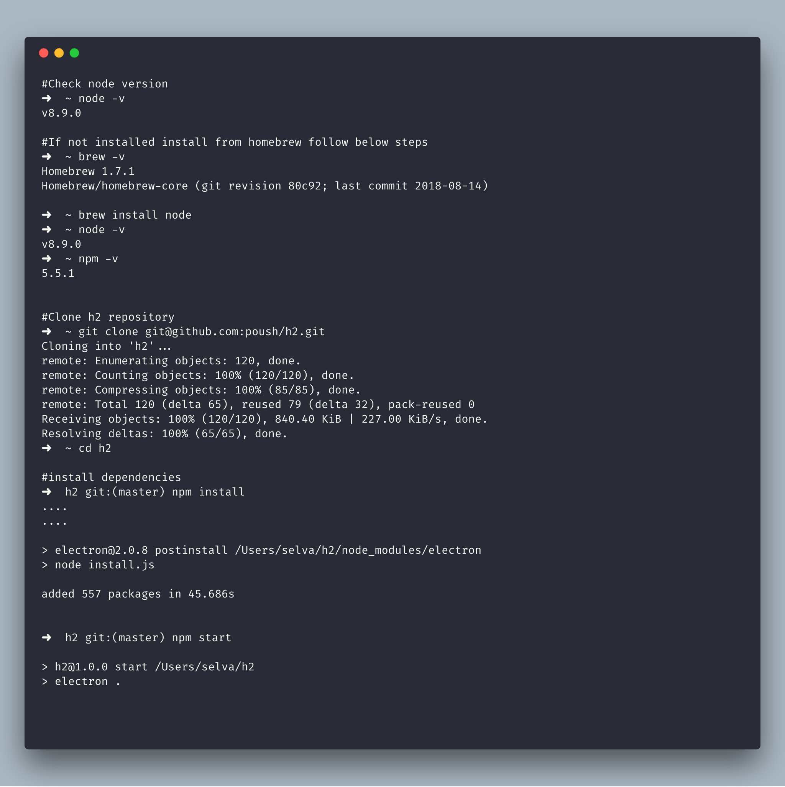
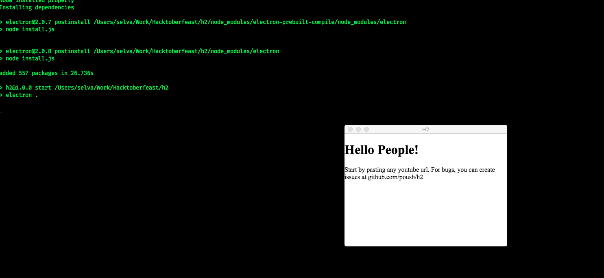

# Mac H2 Installation

Follow the steps from below

### Shell script installation

* For first time install clone the repo https://github.com/poush/h2.git
* Run the shell script `cd h2/install`
* `sh ./mac.sh`

Once started we will be default window like below

Paste any youtube url on opened window using `cmd + shift + v`

Move the window to any place!

